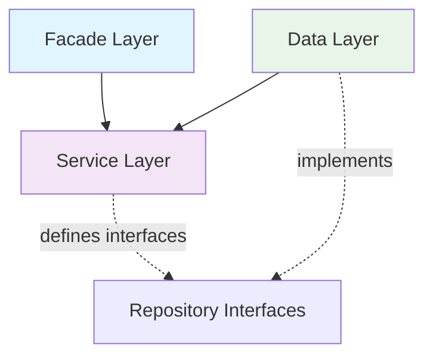

# Adlaar - Advanced Layered Architecture


**Adlaar** (Advanced Layered Architecture) is a Java library that provides guidelines, patterns, and configurable architecture tests for building clean, maintainable backend applications following a dependency-inverted layered architecture.

## Table of Contents

- [Overview](#overview)
- [Architecture Principles](#architecture-principles)
- [Layer Structure](#layer-structure)
- [Dependency Rules](#dependency-rules)
- [Package Organization](#package-organization)
- [Domain Objects and Repository Pattern](#domain-objects-and-repository-pattern)
- [Visibility Rules](#visibility-rules)
- [Framework Dependencies](#framework-dependencies)
- [Architecture Testing](#architecture-testing)
- [Getting Started](#getting-started)
- [Contributing](#contributing)
- [License](#license)

## Overview

Adlaar implements a **3-tier layered architecture** with a crucial twist: **dependency inversion**. Unlike traditional layered architectures where upper layers depend on lower layers, Adlaar inverts the dependency between the Service and Data layers, creating a more flexible and testable design.

### Key Benefits

- **Testability**: Service layer can be tested independently of data persistence
- **Flexibility**: Easy to swap data layer implementations
- **Clean Separation**: Clear boundaries between presentation, business logic, and data access
- **GenAI Friendly**: Architecture tests help AI tools maintain architectural integrity
- **DDD Support**: Built-in support for Domain-Driven Design principles

## Architecture Principles

1. **Dependency Inversion**: Data layer depends on Service layer through interfaces
2. **Single Responsibility**: Each layer has a distinct purpose
3. **Interface Segregation**: Public APIs defined through interfaces
4. **Package by Feature**: Functional organization at the top level
5. **Minimal Public Surface**: Limited public visibility for better encapsulation

## Layer Structure

```
┌─────────────────────────────────────────────────────────────┐
│                      FACADE LAYER                          │
│                 (Controllers, REST APIs)                   │
│                                                             │
│  ┌─────────────────────────────────────────────────────┐   │
│  │                 SERVICE LAYER                       │   │
│  │           (Business Logic, Interfaces)             │   │
│  │                                                     │   │
│  │  ┌─────────────────────────────────────────────┐   │   │
│  │  │              DATA LAYER                     │   │   │
│  │  │        (Repository Implementations)         │   │   │
│  │  └─────────────────────────────────────────────┘   │   │
│  └─────────────────────────────────────────────────────┘   │
└─────────────────────────────────────────────────────────────┘

Dependencies flow INWARD:
Facade → Service ← Data
```

### Layer Responsibilities

| Layer | Purpose | Contains |
|-------|---------|----------|
| **Facade** | Presentation & API | Controllers, REST endpoints, request/response DTOs |
| **Service** | Business Logic | Domain entities, value objects, repository interfaces, business rules |
| **Data** | Data Access | Repository implementations, database entities, data mappers |

## Dependency Rules

The core principle of Adlaar is **dependency inversion** in the data access layer:



### Allowed Dependencies

- ✅ **Facade → Service**: Controllers can use service interfaces
- ✅ **Data → Service**: Repository implementations depend on service interfaces
- ❌ **Service → Data**: Service layer must not depend on data layer
- ❌ **Service → Facade**: Service layer must not depend on facade layer
- ❌ **Data → Facade**: Data layer must not depend on facade layer

## Package Organization

Adlaar follows a **functional package structure** with layer subpackages:

```
src/main/java/
└── com.yourcompany.yourapp/
    ├── users/                     # Functional package
    │   ├── facade/
    │   │   ├── UserController.java
    │   │   └── UserRequest.java
    │   ├── service/
    │   │   ├── User.java          # Domain entity
    │   │   ├── UserService.java   # Business logic
    │   │   └── UserRepository.java # Interface
    │   └── data/
    │       ├── UserRepositoryImpl.java
    │       ├── UserEntity.java    # JPA/Database entity
    │       └── UserMapper.java
    ├── orders/                    # Another functional package
    │   ├── facade/
    │   ├── service/
    │   └── data/
    └── shared/                    # Cross-cutting concerns
        ├── facade/
        ├── service/
        └── data/
```

## Domain Objects and Repository Pattern

### Domain Objects in Service Layer

Following Domain-Driven Design principles:

- **Entities**: Regular Java classes with identity and behavior
- **Value Objects**: Immutable records representing concepts without identity

```java
// Service layer - Domain Entity
public class User {
    private final UserId id;
    private final Email email;
    private final UserStatus status;
    
    // Constructor, methods, business logic
}

// Service layer - Value Object
public record Email(String value) {
    public Email {
        if (!isValid(value)) {
            throw new IllegalArgumentException("Invalid email");
        }
    }
    
    private boolean isValid(String email) {
        // Validation logic
    }
}
```

### Repository Pattern with Dependency Inversion

```java
// Service layer - Repository Interface
public interface UserRepository {
    Optional<User> findById(UserId id);
    void save(User user);
    List<User> findByStatus(UserStatus status);
}

// Data layer - Repository Implementation
class UserRepositoryImpl implements UserRepository {
    private final UserJpaRepository jpaRepository;
    private final UserMapper mapper;
    
    @Override
    public Optional<User> findById(UserId id) {
        return jpaRepository.findById(id.value())
            .map(mapper::toDomainObject);
    }
    
    // Other implementations...
}
```

## Visibility Rules

Adlaar enforces strict visibility rules to maintain proper encapsulation:

### Default Visibility (Package-Private)
- **Facade Layer**: All classes (Controllers, DTOs)
- **Data Layer**: All classes (Repository implementations, entities, mappers)

### Public Visibility
- **Service Layer**: Only interfaces may be public
- Domain entities and value objects should be package-private unless needed across functional packages

```java
// ✅ Correct - Public interface in service layer
public interface UserService {
    User createUser(CreateUserCommand command);
}

// ✅ Correct - Package-private implementation
class UserServiceImpl implements UserService {
    // Implementation
}

// ❌ Incorrect - Public class in facade layer
public class UserController { // Should be package-private
}

// ❌ Incorrect - Public class in data layer  
public class UserRepositoryImpl { // Should be package-private
}
```

## Framework Dependencies

Each layer may depend on specific frameworks and libraries:

### Facade Layer
- Spring Web/MVC
- JAX-RS
- Validation frameworks
- Serialization libraries

### Service Layer
- Jakarta Validation
- Spring Core (for dependency injection)
- Domain-specific libraries
- **No persistence frameworks**

### Data Layer
- Spring Data JPA
- JDBC drivers
- Database migration tools (Flyway, Liquibase)
- Mapping frameworks (MapStruct, ModelMapper)

## Architecture Testing

Adlaar provides configurable architecture tests to automatically verify adherence to the architectural rules:

```java
@ArchTest
public class LayerArchitectureTest {
    
    @Test
    void facadeLayerShouldOnlyDependOnServiceLayer() {
        // Test implementation
    }
    
    @Test
    void serviceLayerShouldNotDependOnFacadeOrDataLayers() {
        // Test implementation
    }
    
    @Test
    void dataLayerShouldOnlyDependOnServiceLayer() {
        // Test implementation
    }
    
    @Test
    void onlyServiceInterfacesShouldBePublic() {
        // Test implementation
    }
}
```

### Benefits for AI Development

- **Continuous Validation**: Architecture tests run in CI/CD pipelines
- **AI Assistant Friendly**: GenAI tools can validate architectural compliance
- **Rapid Feedback**: Immediate detection of architectural violations
- **Documentation as Code**: Tests serve as executable documentation

## Getting Started

### 1. Add Dependency

```xml
<dependency>
    <groupId>com.tonypsilon</groupId>
    <artifactId>adlaar</artifactId>
    <version>1.0.0</version>
</dependency>
```

### 2. Structure Your Project

Organize your code following the functional package structure with layer subpackages.

### 3. Define Domain Objects

Create your entities and value objects in the service layer:

```java
// In service package
public class Product {
    private final ProductId id;
    private final ProductName name;
    private final Money price;
    
    // Business logic methods
}

public record ProductName(String value) {
    // Validation in constructor
}
```

### 4. Create Repository Interfaces

Define repository contracts in the service layer:

```java
// In service package
public interface ProductRepository {
    Optional<Product> findById(ProductId id);
    void save(Product product);
}
```

### 5. Implement Repositories

Implement repositories in the data layer:

```java
// In data package
class ProductRepositoryImpl implements ProductRepository {
    // Implementation using JPA, JDBC, etc.
}
```

### 6. Add Architecture Tests

Include architecture tests in your test suite:

```java
@ExtendWith(AdlaarArchitectureTestExtension.class)
class ArchitectureTest {
    // Tests are automatically discovered and run
}
```

## Contributing

We welcome contributions! Please read our [Contributing Guidelines](CONTRIBUTING.md) for details on:

- Code of Conduct
- Development setup
- Submitting pull requests
- Reporting issues

## License

This project is licensed under the MIT License - see the [LICENSE](LICENSE) file for details.

---

**Adlaar** - Building better architectures, one layer at a time. 🏗️